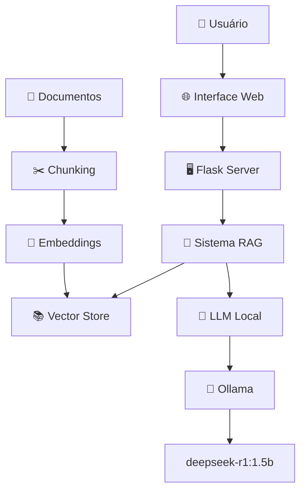

# 🏋️ RAG Treinos - Sistema de Assistente Inteligente para Exercícios Físicos
> Sistema RAG (Retrieval-Augmented Generation) completo para consultas sobre treinos, exercícios e condicionamento físico, com interface web moderna e painel administrativo. OBS: Não coloquei os arquivos .pdf por questões de direitos autorais.

## 📋 Índice

- [🎯 Visão Geral](#-visão-geral)
- [✨ Funcionalidades](#-funcionalidades)
- [🏗️ Arquitetura](#️-arquitetura)
- [📋 Pré-requisitos](#-pré-requisitos)
- [🚀 Instalação](#-instalação)
- [💻 Uso](#-uso)
- [🌐 Interface Web](#-interface-web)
- [📊 API Reference](#-api-reference)
- [📁 Estrutura do Projeto](#-estrutura-do-projeto)
- [⚙️ Configuração](#️-configuração)
- [🔧 Desenvolvimento](#-desenvolvimento)
- [🚨 Solução de Problemas](#-solução-de-problemas)

## 🎯 Visão Geral

O **RAG Treinos** é um sistema inteligente que combina a precisão da busca vetorial com a capacidade de geração de linguagem natural para fornecer respostas contextualizadas sobre exercícios físicos, técnicas de treinamento e condicionamento físico.

### 🔍 **O que é RAG?**

RAG (Retrieval-Augmented Generation) é uma técnica que:
- **Busca** informações relevantes em uma base de conhecimento
- **Aumenta** o contexto do modelo de linguagem
- **Gera** respostas precisas e embasadas em fontes confiáveis

### 🏋️ **Por que Treinos?**

- **Segurança**: Informações incorretas podem causar lesões
- **Precisão**: Técnicas de exercícios requerem instruções detalhadas
- **Personalização**: Adaptação para diferentes níveis e objetivos
- **Atualização**: Incorporação de novas metodologias e pesquisas

## ✨ Funcionalidades

### 🤖 **Sistema RAG Core**
- ✅ Processamento de documentos PDF, TXT, DOCX, MD
- ✅ Divisão inteligente em chunks com overlap
- ✅ Embeddings vetoriais otimizados (sentence-transformers)
- ✅ Busca semântica com FAISS/Chroma
- ✅ Geração de respostas contextualizadas
- ✅ Citação automática de fontes

### 🌐 **Interface Web**
- ✅ Chat interativo em tempo real
- ✅ Design responsivo (desktop/mobile)
- ✅ Sistema de feedback com avaliações
- ✅ Exemplos de perguntas clicáveis
- ✅ Exportação de conversas
- ✅ Status do sistema em tempo real

### 🔧 **Painel Administrativo**
- ✅ Monitoramento de performance
- ✅ Estatísticas detalhadas
- ✅ Análise de feedback dos utilizadores
- ✅ Logs de atividade
- ✅ Controle do sistema
- ✅ Exportação de dados

### 📊 **Analytics e Monitoramento**
- ✅ Métricas de performance
- ✅ Tempo de resposta
- ✅ Taxa de satisfação
- ✅ Análise de consultas
- ✅ Gráficos em tempo real

## 🏗️ Arquitetura



### 🔄 **Fluxo de Processamento**

1. **📄 Carregamento**: Documentos são processados e validados
2. **✂️ Chunking**: Textos divididos em pedaços com overlap
3. **🔢 Embeddings**: Conversão para vetores semânticos
4. **🗄️ Indexação**: Armazenamento no vector store (FAISS)
5. **🔍 Busca**: Recuperação de documentos similares
6. **🤖 Geração**: LLM gera resposta baseada no contexto
7. **📋 Resposta**: Retorno com citações e metadados

## 📋 Pré-requisitos

### 🐍 **Software Necessário**
- **Python 3.8+** ([Download](https://python.org))
- **Ollama** ([Download](https://ollama.com))
- **Git** (opcional, para clonagem)

### 🤖 **Modelo LLM**
```bash
# Instalar modelo deepseek-r1:1.5b via Ollama
ollama pull deepseek-r1:1.5b
```

### 📚 **Base de Conhecimento**
- Documentos sobre treinos (PDF, TXT, DOCX, MD)
- Mínimo: 5-10 documentos
- Recomendado: 15+ documentos especializados

## 🚀 Instalação

### 1️⃣ **Clone o Repositório**
```bash
git clone  https://github.com/DenisSMorais2/RAG-Treinos.git
cd rag-treinos
```

### 2️⃣ **Instalar Dependências**
```bash
pip install langchain langchain-community langchain-ollama
pip install sentence-transformers faiss-cpu chromadb
pip install pypdf python-docx
pip install flask flask-cors
pip install streamlit matplotlib seaborn pandas
```

### 3️⃣ **Configurar Ollama**
```bash
# Verificar se Ollama está instalado
ollama --version

# Iniciar serviço Ollama
ollama serve

# Baixar modelo (em outro terminal)
ollama pull deepseek-r1:1.5b
```

### 4️⃣ **Preparar Documentos**
```bash
# Criar pasta para documentos
mkdir documentos_treino

# Adicionar seus PDFs de treino na pasta
cp seus_pdfs_de_treino/* documentos_treino/
```

### 5️⃣ **Inicializar Sistema RAG**
```bash
# Primeira execução (criar vectorstore)
python RAG.py
```

### 6️⃣ **Configurar Interface Web**
```bash
# Setup do servidor web
python setup_web.py

# Copiar templates (veja instruções no terminal)
# Copiar conteúdo dos artifacts para templates/
```

### 7️⃣ **Iniciar Servidor Web**
```bash
# Iniciar servidor Flask
python rag_server.py

# Ou usar script automático
python start_server.py
```

## 💻 Uso

### 🖥️ **Terminal (CLI)**
```bash
# Executar interface de terminal
python RAG.py

# Comandos disponíveis:
# - Digite perguntas sobre treinos
# - 'info' para estatísticas
# - 'exemplo' para perguntas exemplo
# - 'analise' para análise dos documentos
# - 'busca [query]' para busca semântica
# - 'relatorio' para gerar relatório
# - 'sair' para encerrar
```

### 🌐 **Interface Web**
```bash
# Acessar no navegador
http://localhost:5000

# Funcionalidades:
# ✅ Chat interativo
# ✅ Avaliação de respostas
# ✅ Exemplos clicáveis
# ✅ Exportação de conversas
```

### 🔧 **Painel Admin**
```bash
# Acessar painel administrativo
http://localhost:5000/admin

# Recursos:
# ✅ Monitoramento em tempo real
# ✅ Estatísticas detalhadas
# ✅ Análise de feedback
# ✅ Controle do sistema
```

## 🌐 Interface Web

### 💬 **Chat Principal**

<details>
<summary>🎨 Visualizar Interface</summary>

```
┌─────────────────────────────────────────────────────────┐
│  🏋️ RAG Treinos - Assistente Inteligente               │
├─────────────────────────────────────────────────────────┤
│ 🟢 Sistema online | Consultas: 45 | Tempo médio: 2.1s │
├─────────────────────────────────────────────────────────┤
│                                                         │
│ 🤖 Olá! Como posso ajudar com seus treinos?           │
│                                                         │
│ 👤 Exercícios para fortalecer o peito                  │
│                                                         │
│ 🤖 Para fortalecer o peito, recomendo:                │
│     • Supino reto: 3x8-12 repetições                  │
│     • Flexão: 3x10-15 repetições                      │
│     • Crucifixo: 3x10-12 repetições                   │
│     ⏱️ 2.3s | 📚 3 fontes consultadas                  │
│     ⭐⭐⭐⭐⭐ [Avaliar resposta]                        │
│                                                         │
├─────────────────────────────────────────────────────────┤
│ 💬 [Digite sua pergunta sobre treinos...]  [📤 Enviar] │
└─────────────────────────────────────────────────────────┘
```

</details>

### 📊 **Painel Administrativo**

<details>
<summary>🔧 Visualizar Admin</summary>

```
┌─────────────────────────────────────────────────────────┐
│  🔧 Painel de Administração - RAG Treinos              │
├─────────────────────────────────────────────────────────┤
│ 🟢 Sistema Online | Saúde: ████████████ 100%          │
├─────────────────────────────────────────────────────────┤
│                                                         │
│ 📊 ESTATÍSTICAS        │  📈 PERFORMANCE                │
│ • Consultas: 127       │  • Tempo médio: 2.1s          │
│ • Documentos: 15       │  • Taxa sucesso: 98%          │
│ • Chunks: 1598         │  • Satisfação: 4.7/5          │
│ • Modelo: deepseek-r1  │  • Uptime: 99.2%              │
│                        │                                │
│ 📝 ATIVIDADE RECENTE   │  ⭐ FEEDBACK                   │
│ [14:30] Consulta OK    │  • Avaliação média: 4.7       │
│ [14:28] Sistema reload │  • Total feedbacks: 89        │
│ [14:25] Nova consulta  │  • Satisfação: 94%            │
│                        │                                │
├─────────────────────────────────────────────────────────┤
│ [🔄 Atualizar] [🔃 Reload] [📊 Exportar] [🏠 Voltar]  │
└─────────────────────────────────────────────────────────┘
```

</details>

## 📊 API Reference

### 🔍 **Endpoints de Consulta**

#### `POST /api/query`
Processa uma pergunta e retorna resposta do RAG.

**Request:**
```json
{
  "question": "Exercícios para fortalecer o core"
}
```

**Response:**
```json
{
  "answer": "Para fortalecer o core, recomendo...",
  "sources": [
    {
      "filename": "manual_core.pdf",
      "content": "O core é composto por..."
    }
  ],
  "response_time": 2.3,
  "timestamp": "2025-01-20T10:30:00Z"
}
```

#### `GET /api/examples`
Retorna exemplos de perguntas.

**Response:**
```json
[
  "Qual o melhor exercício para peito?",
  "Como fazer agachamento corretamente?",
  "Programa de treino para iniciantes"
]
```

### 📈 **Endpoints de Monitoramento**

#### `GET /api/stats`
Retorna estatísticas do sistema.

**Response:**
```json
{
  "total_queries": 127,
  "avg_response_time": 2.1,
  "system_status": "Online",
  "rag_loaded": true,
  "documents_count": 15,
  "chunks_count": 1598,
  "model": "deepseek-r1:1.5b"
}
```

#### `POST /api/feedback`
Recebe feedback do usuário.

**Request:**
```json
{
  "question": "Exercícios para peito",
  "answer": "Para fortalecer o peito...",
  "rating": 5,
  "comment": "Resposta muito útil!"
}
```

### 🔧 **Endpoints Administrativos**

#### `GET /api/admin/reload`
Recarrega o sistema RAG.

#### `GET /api/history`
Retorna histórico de conversas.

## 📁 Estrutura do Projeto

```
rag-treinos/
├── 📄 RAG.py                    # Sistema RAG principal
├── 🌐 rag_server.py            # Servidor web Flask
├── 📖 README.md               # Este arquivo
│
├── 📁 documentos_treino/       # Base de conhecimento
│   ├── treino_peito.pdf
│   ├── exercicios_core.pdf
│   └── ...
│
├── 📁 templates/              # Templates HTML
│   ├── index.html            # Interface principal
│   └── admin.html            # Painel administrativo
│
├── 📁 vectorstore_faiss/     # Índice vetorial FAISS
├── 📁 vectorstore_chroma/    # Índice vetorial Chroma (alternativo)
```

## ⚙️ Configuração

### 🎛️ **Arquivo config.py**

```python
# Modelos LLM disponíveis
MODELOS_LLM = [
    "deepseek-r1:1.5b",      # Padrão o utilizado no projeto
    "llama3.2:3b",           # Alternativo
    "mistral:7b",            # Maior capacidade
    "qwen2.5:7b"             # Multilíngue
]

# Modelos de embedding
MODELOS_EMBEDDING = [
    "sentence-transformers/all-MiniLM-L6-v2",          # Rápido
    "sentence-transformers/paraphrase-multilingual-MiniLM-L12-v2",  # Multilíngue
    "neuralmind/bert-base-portuguese-cased"             # Português
]

# Configurações de chunking
CHUNK_SIZE = 1000
CHUNK_OVERLAP = 200

# Configurações de busca
TOP_K_DOCUMENTS = 4
TEMPERATURE = 0.3

# Servidor web
HOST = "0.0.0.0"
PORT = 5000
DEBUG = False
```

### 🔧 **Variáveis de Ambiente**

```bash
# Arquivo .env (opcional)
OLLAMA_HOST=http://localhost:11434
RAG_MODEL=deepseek-r1:1.5b
EMBEDDING_MODEL=sentence-transformers/all-MiniLM-L6-v2
CHUNK_SIZE=1000
TEMPERATURE=0.3
```

## 🔧 Desenvolvimento

### 🛠️ **Setup de Desenvolvimento**

```bash
# Clone o repositório
git clone https://github.com/seu-usuario/rag-treinos.git
cd rag-treinos

# Criar ambiente virtual
python -m venv venv
source venv/bin/activate  # Linux/Mac
# venv\Scripts\activate   # Windows

# Instalar dependências de desenvolvimento
pip install -r requirements.txt
pip install pytest black flake8 mypy

# Configurar pre-commit hooks
pre-commit install
```

### 🧪 **Testes**

```bash
# Executar testes
python -m pytest tests/

# Teste específico
python -m pytest tests/test_rag.py

# Com cobertura
python -m pytest --cov=rag_treinos tests/
```

### 🎨 **Formatação de Código**

```bash
# Formatar código
black rag_treinos/

# Verificar estilo
flake8 rag_treinos/

# Verificar tipos
mypy rag_treinos/
```

### 📝 **Contribuindo**

1. **Fork** do repositório
2. **Criar** branch feature (`git checkout -b feature/nova-funcionalidade`)
3. **Commit** das mudanças (`git commit -am 'Adiciona nova funcionalidade'`)
4. **Push** para branch (`git push origin feature/nova-funcionalidade`)
5. **Abrir** Pull Request

## 🚨 Solução de Problemas

### ❌ **Problemas Comuns**

<details>
<summary>🔍 Template not found</summary>

**Problema:** `TemplateNotFound: index.html`

**Solução:**
```bash
# Verificar se templates existem
ls templates/

# Copiar templates dos artifacts
# 1. Copiar conteúdo do artifact "Interface Principal"
# 2. Salvar em templates/index.html
# 3. Copiar conteúdo do artifact "Painel Admin"  
# 4. Salvar em templates/admin.html
```
</details>

<details>
<summary>🤖 RAG system not initialized</summary>

**Problema:** Sistema RAG não inicializado

**Solução:**
```bash
# Executar setup completo
python RAG.py

# Verificar vectorstore
ls vectorstore_faiss/

# Se não existir, escolher 'n' para criar novo
```
</details>

<details>
<summary>🦙 Ollama connection error</summary>

**Problema:** Erro de conexão com Ollama

**Solução:**
```bash
# Verificar se Ollama está rodando
ollama list

# Iniciar serviço
ollama serve

# Verificar modelo
ollama pull deepseek-r1:1.5b
```
</details>

<details>
<summary>🔌 Port already in use</summary>

**Problema:** Porta 5000 em uso

**Solução:**
```bash
# Matar processo na porta 5000
lsof -ti:5000 | xargs kill -9

# Ou alterar porta em rag_server.py
app.run(host='0.0.0.0', port=5001)
```
</details>

<details>
<summary>📦 ModuleNotFoundError</summary>

**Problema:** Módulo não encontrado

**Solução:**
```bash
# Reinstalar dependências
pip install -r requirements.txt

# Verificar versão Python
python --version  # Deve ser 3.8+

# Ativar ambiente virtual
source venv/bin/activate
```
</details>

### 🔍 **Debug Mode**

```bash
# Executar em modo debug
export FLASK_DEBUG=1
python rag_server.py

# Ou alterar no código
app.run(debug=True)
```

### 📋 **Logs**

```bash
# Ver logs do sistema
tail -f logs/rag_system.log

# Logs do Flask
tail -f logs/flask.log

# Logs do Ollama
tail -f ~/.ollama/logs/server.log
```

## 📈 Performance

### ⚡ **Métricas de Performance**

| Métrica | Valor Típico | Observações |
|---------|--------------|-------------|
| **Tempo de resposta** | 2-4 segundos | Depende do modelo LLM |
| **Busca vetorial** | 50-150ms | Depende do tamanho da base |
| **Throughput** | 10-30 req/min | Modelo local |
| **RAM utilizada** | 2-4GB | Com embeddings carregados |
| **Armazenamento** | 500MB-2GB | Vectorstore + modelos |

### 🚀 **Otimizações**

#### **Cache de Respostas**
```python
# Implementar cache Redis/Memcached
from functools import lru_cache

@lru_cache(maxsize=100)
def cached_query(question):
    return rag_system.query(question)
```

#### **Batch Processing**
```python
# Processar múltiplas consultas
def batch_query(questions):
    return [rag_system.query(q) for q in questions]
```

#### **Modelo Menor**
```bash
# Usar modelo menor para mais velocidade
ollama pull llama3.2:1b
```

### 📊 **Monitoramento**

```python
# Métricas customizadas
import time
import psutil

def monitor_performance():
    return {
        'cpu_percent': psutil.cpu_percent(),
        'memory_percent': psutil.virtual_memory().percent,
        'response_time': measure_response_time(),
        'queries_per_minute': calculate_qpm()
    }
```
## Frontend e terminal iterativo:
### Admin Pag:


### User Pag:


### Iterative Terminal:


